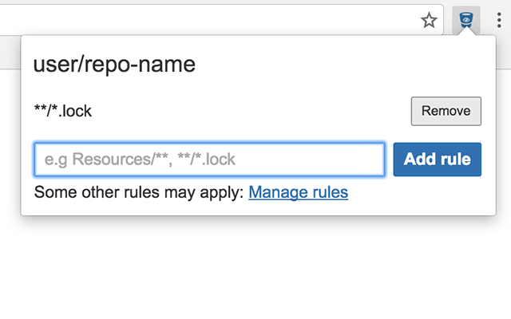

# hide-files-from-bitbucket-pr

Hide irrelevant files from Bitbucket pull requests.

* [Install for Chrome](https://chrome.google.com/webstore/detail/hide-files-from-bitbucket/jkndmdikjlefnimdlpmoembjkppanpaf)
* [How to](#how-to)
* [How do the patterns work?](#how-do-the-patterns-work)

## How to

1. Once the extension is installed, access to a pull request's page (should look like `https://bitbucket.org/<user>/<repo>/pull-requests/...`)
2. Click on the extension's icon
3. Active rules for the current project are listed here, you can also add new ones
4. When you're done editing the rules, reload the page

## How do the patterns work?

The extension uses [minimatch](https://github.com/isaacs/minimatch) to match paths against the rules.
You can use [globtester](http://www.globtester.com/) if you want to test some rules.
